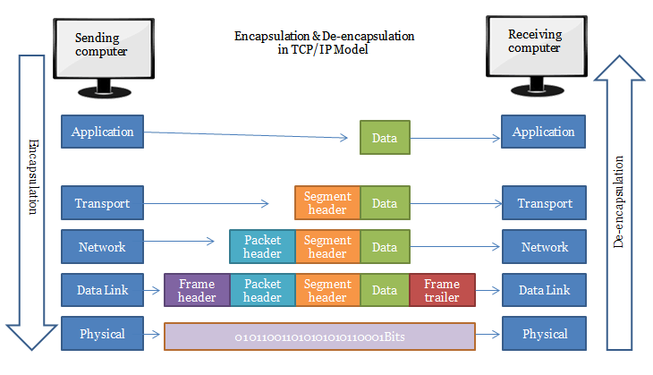

# uefi-snp-tcp

A lightweight project exploring the UEFI networking stack, using the Simple Network Protocol (SNP) to build basic networking functionality in Rust.

## How to Compile

```
$ cargo build --target x86_64-unknown-uefi
```

## Setting Up a Test Environment

The test environment is pre-configured in the `qemu` directory. To start the environment, simply run the provided script:

```
$ cd qemu
# ./start-qemu.sh
```

Once QEMU is running and the TAP interface is up, you can interact with the test network. For example, send ping within the virtual network:

```
$ ping -I tap0 -4 192.168.0.3
```

You can monitor network traffic using a tool like [tshark](https://www.wireshark.org/docs/man-pages/tshark.html):

```
$ tshark -i tap0
```

_Note_: The file `OVMF-debug-full-network-stack.fd` is a debug build of OVMF, containing a full suite of accessible network drivers. It was generated using the following build configuration and is based on [commit 0f3867fa](https://github.com/tianocore/edk2/commit/0f3867fa6ef0553e26c42f7d71ff6bdb98429742).

```
build --buildtarget=DEBUG --platform=OvmfPkg/OvmfPkgX64.dsc \
  -D NETWORK_ENABLE=TRUE \
  -D NETWORK_SNP_ENABLE=TRUE \
  -D NETWORK_IP4_ENABLE=TRUE \
  -D NETWORK_IP6_ENABLE=TRUE \
  -D NETWORK_TLS_ENABLE=TRUE \
  -D NETWORK_HTTP_ENABLE=TRUE \
  -D NETWORK_HTTP_BOOT_ENABLE=TRUE \
  -D NETWORK_ALLOW_HTTP_CONNECTIONS=TRUE \
  -D NETWORK_ISCSI_ENABLE=TRUE \
  -D NETWORK_ISCSI_MD5_ENABLE=TRUE \
  -D NETWORK_VLAN_ENABLE=TRUE
```

## Theory

### TUN / TAP Interface

TODO: document

### UEFI Networking Stack

UEFI supports several types of network device drivers:
* **UNDI** (Universal Network Driver Interface)
* **SNP** (Simple Network Protocol)
* **MNP** (Managed Network Protocol)

The architecture of network device drivers and network stack is shown below.


_NOTE_: It is recommended that network device driver is implemented as **UNDI** device driver, so as to reuse the **SNP** and **MNP** component in system Firmware.

The following figure shows a possible network stack based on a network driver producing **SNP**. The inclusion of the Load File Protocol is optional and depends on the system firmware:


Usually UEFI network stack is fully available and consists the next UEFI network drivers that are build-in into the UEFI platform implementation:

- SNP
- MNP
- IPv4 stack: Arp, DHCP, IP, UDP, MTFTP
- IPv6 stack: DHCP, IP, UDP, MTFTP
- TCP

For more details, take a look at the following documents related to EDKII. This framework and its module are used in almost all open and proprietary UEFI solutions such as AMI Aptio V.

* [EDKII Network Over QEMU](https://github.com/tianocore/tianocore.github.io/wiki/EDKII-Network-Over-QEMU)
* [NetworkPkg Getting Started Guide](https://github.com/tianocore/tianocore.github.io/wiki/NetworkPkg-Getting-Started-Guide)
* [UEFI Driver Writers Guide, 25 Network Driver Design Guidelines](https://github.com/tianocore-docs/edk2-UefiDriverWritersGuide/tree/master/25_network_driver_design_guidelines)
* [UEFI Specification, Network Protocols — SNP, PXE, BIS and HTTP Boot](https://uefi.org/specs/UEFI/2.10/24_Network_Protocols_SNP_PXE_BIS.html#simple-network-protocol)

And feel free to explore the source code of [NetworkPkg](https://github.com/tianocore/edk2/tree/master/NetworkPkg) by yourself. 

Unfortunately, at this point, [UEFI Rust crate](https://docs.rs/uefi/latest/uefi/) supports **SNP** only. This project works within that limitation.

### Protocol Data Units (PDUs)

**Segments, Packets, and Frames** are the names given to [Protocol Data Units (PDUs)](https://en.wikipedia.org/wiki/Protocol_data_unit) at different network layers:

* **Segments** (refers to TCP) / **Datagrams** (typically refers to UDP) are units of data in the _Transport Layer_.
* **Packets** are units of data in the _Network Layer (IP)_
* **Frames** are units of data in the _Link Layer_ (e.g., Wi-Fi, Bluetooth, Ethernet).

Here’s how data moves through the layers:



### Ethernet II Frame

The internal structure of an Ethernet frame follows IEEE 802.3 specifications:

* MAC destination - 6 bytes
* MAC source - 6 bytes
* 802.1Q tag (optional) - 4 bytes
* Ethertype - 2 bytes
* Payload - Variable size
* Frame check sequence[^1] - 4 bytes

[^1]: TAP interface doesn't provide FCS.

### Address Resolution Protocol (ARP)

Reference: [RFC 826](https://datatracker.ietf.org/doc/html/rfc826).

ARP resolves IP addresses to MAC addresses.

* [Traditional ARP](https://www.practicalnetworking.net/series/arp/traditional-arp/)

_Note_: In IPv6, the functionality of ARP is not used anymore. It's provided by the Neighbor Discovery Protocol (NDP).

### Internet Protocol version 4 (IPv4)

Reference: [RFC 791](https://datatracker.ietf.org/doc/html/rfc791).

IPv4 uses 32-bit addresses, limiting the address space to 4,294,967,296 (2^32) addresses.

#### Internet Control Message Protocol (ICMP) v4

Reference: [RFC 792](https://datatracker.ietf.org/doc/html/rfc792).

[RFC1122](https://datatracker.ietf.org/doc/html/rfc1122). defines the relationship between IPv4 and ICMP: 

> ICMP is a control protocol that is considered to be an integral part of IP, although it is architecturally layered upon IP ...

#### Transmission Control Protocol (TCP)

Reference: [RFC 793](https://datatracker.ietf.org/doc/html/rfc793).

## Internet checksum

Reference: [RFC 1071](https://datatracker.ietf.org/doc/html/rfc1071).

Both ICMP and IP headers use the same checksum calculation. See [this discussion](https://stackoverflow.com/questions/36105998/icmp-header-and-ip-header-checksum-calculations) for an explanation.
